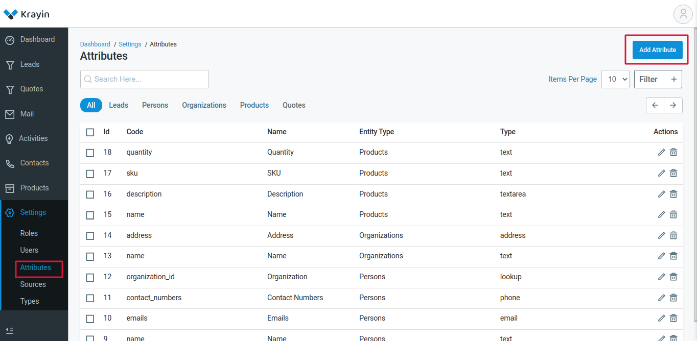

# Create and using a new attribute

Let's have an example of Product's attributes
1. Name
2. SKU
3. Quantity

These are few product's attributes which have been created by system while CRM installation.

