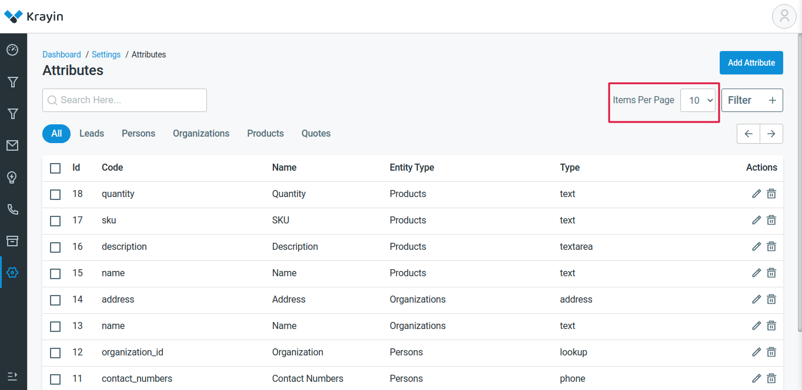
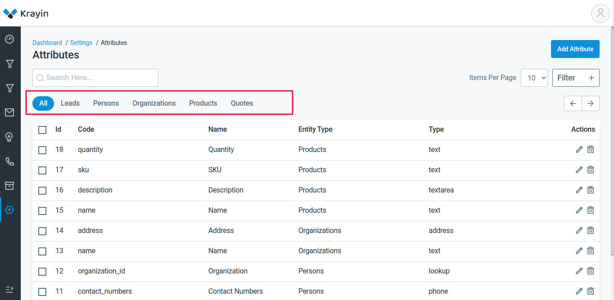

# Create a new datagrid

There are some mandatory functions to display a datagrid

~~~
    class TestDataGrid extends DataGrid
    {
        public function prepareQueryBuilder()
        {
        }

        public function addColumns()
        {
        }

        public function prepareActions()
        {
        }
    }
~~~

hide search field
~~~
$enableSearch = false;
~~~

hide per page field
~~~
$enablePerPage = false;
~~~

we can also add tab filters inside datagrid_filters.php resides in config

