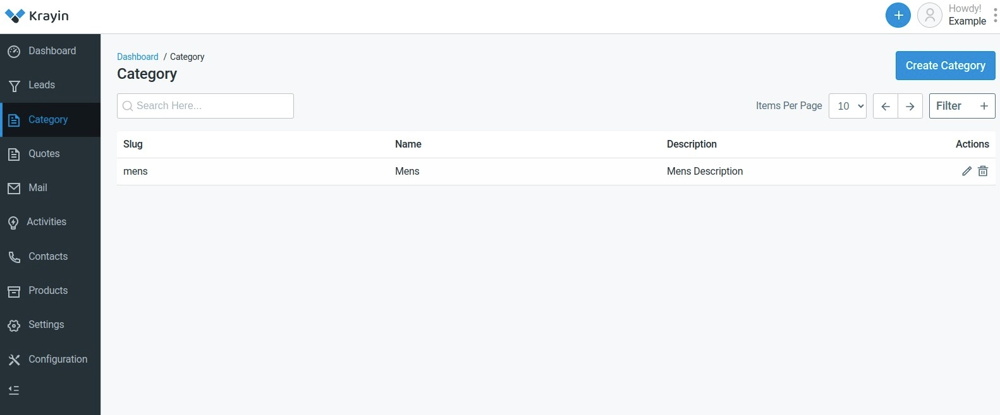

# Admin Menu

[[TOC]]

## Directory Structure

To ensure that the admin menu includes the necessary configuration, follow these steps:

1. In your package's source directory, which is typically located at **`packages/Webkul/Category/src`**, create a new folder named **`Config`** if it doesn't already exist.
   ```
    └── packages
        └── Webkul
            └── Category
                └── src
                    ├── ...
                    └── Config
                        └── admin-menu.php
   ```

2. Inside the newly created **`Config`** folder, create a file named **`admin-menu.php`**.

3. Copy and paste the following code into the **`admin-menu.php`** file:

    ```php
    <?php

    return [
        [
            'key'        => 'categories',
            'name'       => 'Categorys',
            'route'      => 'category.admin.index',
            'sort'       => 2,
            'icon-class' => 'category-icon',
        ],
    ];
    ```

4. In your **`admin-routes.php`** file (located in the same package's source directory), add the named route **`category.admin.index`** as follows:

    ```php
    Route::get('/categories', [CategoryController::class, 'index'])->name('category.admin.index');
    ```

    In this step, we define the route that corresponds to the menu item added in the previous step.

## Add Menu Icon

5. To add the menu icon styling, open the **`assets/scss/admin.scss`** file within your package and add the following code:

    ```css
    .category-icon {
        background-image: url("../images/category.png");
        width: 45px;
        height: 45px;
        opacity: 0.6;
        margin-left: 4px !important;
    }

    .active {
        .category-icon {
            opacity: 1;
            background-image: url("../images/category-active.png");
        }
    }
    ```

    Ensure that you have the necessary **`.png`** image files (**`category.png`** and **`category-active.png`**) and manually place them inside the **`assets/images`** folder of your package.

6. To merge the **`admin-menu.php`** configuration with the core menu file, use the **`mergeConfigFrom()`** method in the **`register()`** method of your package's service provider. Here's an example:

    ```php
    <?php

    namespace Webkul\Category\Providers;

    use Illuminate\Support\ServiceProvider;

    class CategoryServiceProvider extends ServiceProvider
    {
        /**
         * Register services.
         *
         * @return void
         */
        public function register()
        {
            $this->mergeConfigFrom(
                dirname(__DIR__) . '/Config/admin-menu.php', 'menu.admin'
            );
        }
    }
    ```

7. Finally, run the following command to optimize your application:

    ```
    php artisan optimize
    ```

    After completing these steps, the menu item should appear in the admin panel.

    ::: details Admin Menu Output

    

    :::