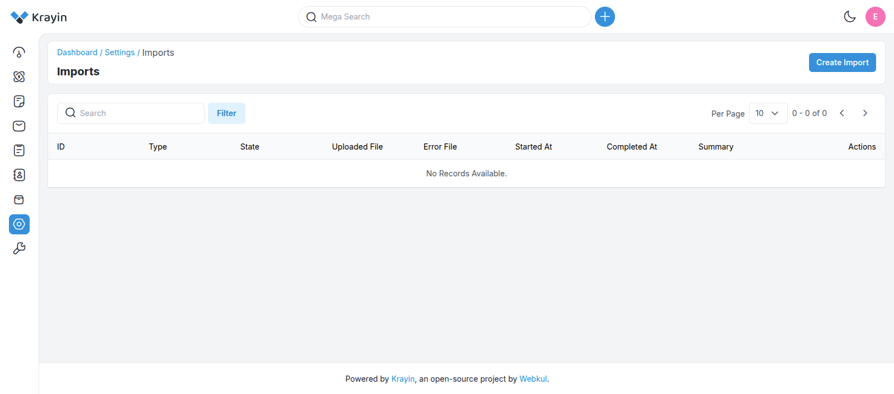
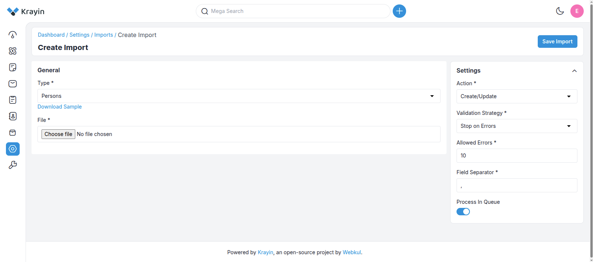
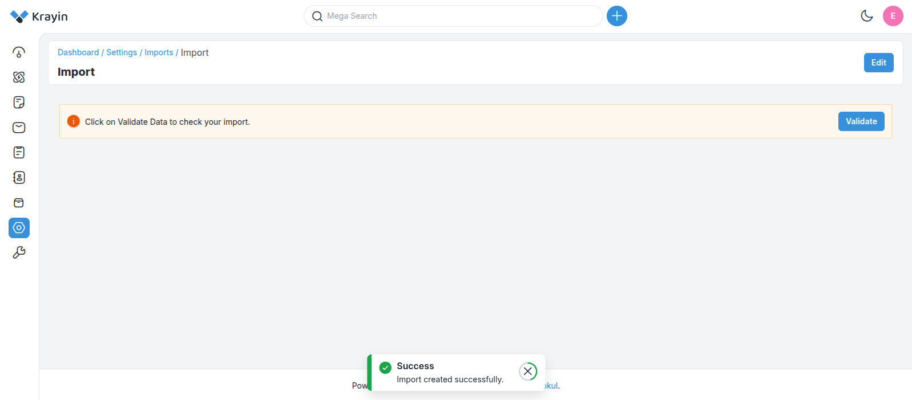
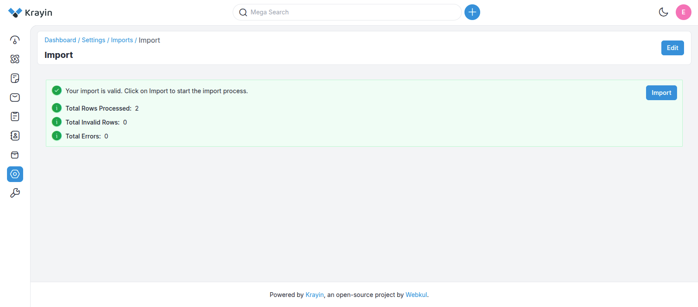
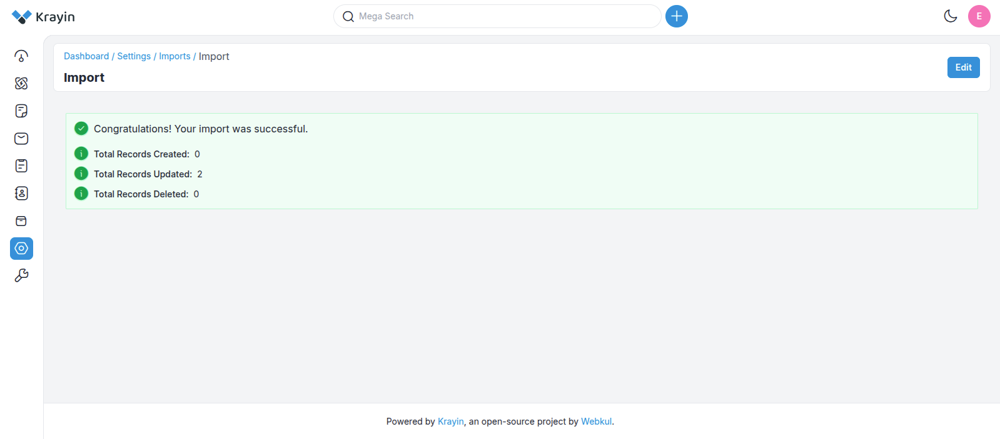

[[TOC]]

## Introduction

The **Data Transfer Package** enables efficient import of large datasets from spreadsheet files (CSV and XLSX) into your application, supporting entities such as leads, products, and persons. Leveraging Laravel's queue system, the package ensures smooth performance even during high-volume imports. It also includes robust validation and error-handling strategies to maintain data integrity throughout the process.

## Features

1. **Queue and Non-Queue Based Import**: Supports importing via Laravel queues for background processing or direct imports for smaller datasets (without queue/sync).
2. **Spreadsheet Data Validation (CSV & XLSX)**: Validate data from spreadsheet files (CSV and XLSX) before importing to ensure data integrity.
3. **Validation Strategies**: Choose between different strategies to handle data errors (`Stop on Error`, `Skip Errors`).
4. **CSV Delimiter Customization**: Support for different delimiters in CSV files (e.g., `,`, `;`).
5. **Allowed Errors**: Configure the number of allowable errors before the process fails.
6. **CRUD Actions**: Supports Create, Update, and Delete operations.
7. **Editable Import Preview**: Review and edit spreadsheet data before finalizing the import.

## Usage

### Accessing the DataTransfer



To access the **Data Transfer package**:

1. Navigate to the **Settings** page.
2. Search for **"Data Transfer"**.
3. Click on it to reach the index page.

### Create Page



The **Create page** allows you to upload entities such as **persons**, **products**, and **leads** into the application.

#### General Section (Left Side):

* **Download Sample CSV**: Select the entity type and click **"Download Sample"** to get a dummy CSV.
* **Edit the Sample**: Modify the downloaded file with your actual data.
* **Upload File**: Use the file input to upload the modified CSV.

#### Settings Panel (Right Side):

* **Action**: Choose between `Create`, `Update`, or `Delete`.
* **Validation Strategy**:

  * `Stop on Error`: Halts on the first encountered error.
  * `Skip Errors`: Continues processing by skipping invalid rows.
* **Additional Options**:

  * Set the number of **allowed errors**.
  * Define the **CSV field separator** (e.g., `,` or `;`).
  * Enable **"Process in Queue"** for background processing.

> **Note:**
> If using queue processing, update your `.env` file with one of the following:
>
> ```env
> QUEUE_CONNECTION=database
> ```
>
> or
>
> ```env
> QUEUE_CONNECTION=redis
> ```

Once everything is set, click **"Save Import"** to continue.

### Import without Queue

To import without using Laravel queues, simply turn off the queue option in the UI.

::: tip
This is not recommended only for **small datasets**.
:::

### Import with Queue

For large datasets, enable **queue processing** to improve performance. Make sure a queue worker is running.

#### Supervisor Setup

To keep the Laravel queue worker running:

```bash
sudo apt-get install supervisor
```

Create a configuration file:

```ini
[program:laravel-worker]
process_name=%(program_name)s_%(process_num)02d
command=php /path-to-your-project/artisan queue:work --sleep=3 --tries=3 --max-time=3600
autostart=true
autorestart=true
stopasgroup=true
killasgroup=true
user=your-username
numprocs=8
redirect_stderr=true
stdout_logfile=/path-to-your-project/worker.log
stopwaitsecs=3600
```

Update and start Supervisor:

```bash
sudo supervisorctl reread
sudo supervisorctl update
sudo supervisorctl start "laravel-worker:*"
```

Or run manually:

```bash
php artisan queue:work
```

### Imported Page



After clicking **"Save Import"**, you will be redirected to the **Imported page**. Here, you can:

* **Preview and validate** the imported spreadsheet files (CSV and XLSX) data.
* **Edit entries** before finalizing the import.

This ensures that your data matches the application's validation rules. If no errors are detected and all configurations are correct, the application will **successfully import** the data into the database. The import completes, and the new records become available in your system.

### Validation Results



This page shows validation results after checking your uploaded spreadsheet files (CSV and XLSX) file.

If errors are found (e.g., unsupported formats, missing required fields):

* They will be listed in detail.
* You must correct the errors before proceeding.

### Successful Import



If no errors are detected and all configurations are correct, the application will successfully import the data into the database. The import completes, and the new records become available in your system.

## Error Handling

* Configure the **allowed number of errors**.
* If the threshold is exceeded, the import process will fail.
* Detailed **error reports** are generated showing which rows failed and why.

## CRUD Operations During Import

1. **Create**: Adds new records if they do not exist.
2. **Update**: Modifies existing records based on identifiers.
3. **Delete**: Removes existing records. Validation error shown if data doesn’t exist.

## Editing Imported Data

Before finalizing, the system allows you to:

* **Review and edit** the imported data.
* Ensure accuracy before committing the data to the database.

You can also adjust the queue configuration in `config/queue.php`.


## Conclusion

The **Data Transfer Package** in Krayin offers a comprehensive and flexible solution for importing spreadsheet files (CSV and XLSX) data. With queue support, validation strategies, customizable delimiters, and robust error handling, it ensures data is imported safely and efficiently.

Whether you're importing a few records or millions, this package streamlines the process and ensures data integrity every step of the way.
