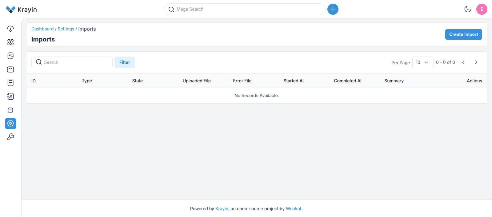
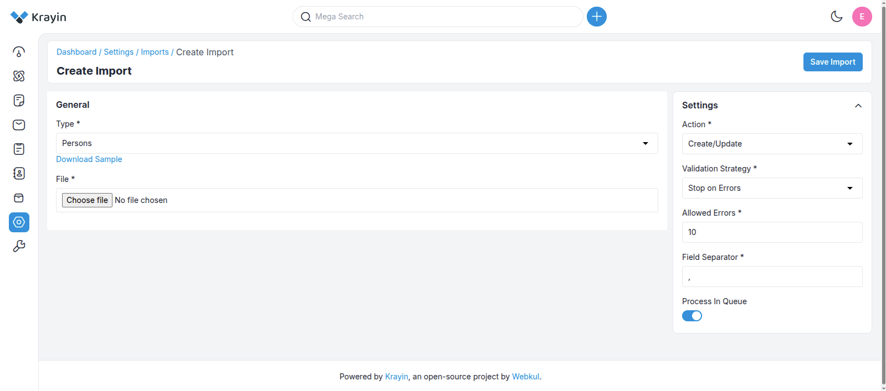
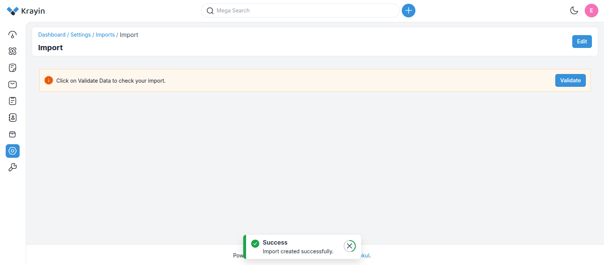
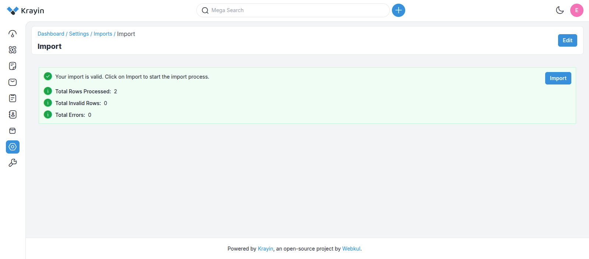
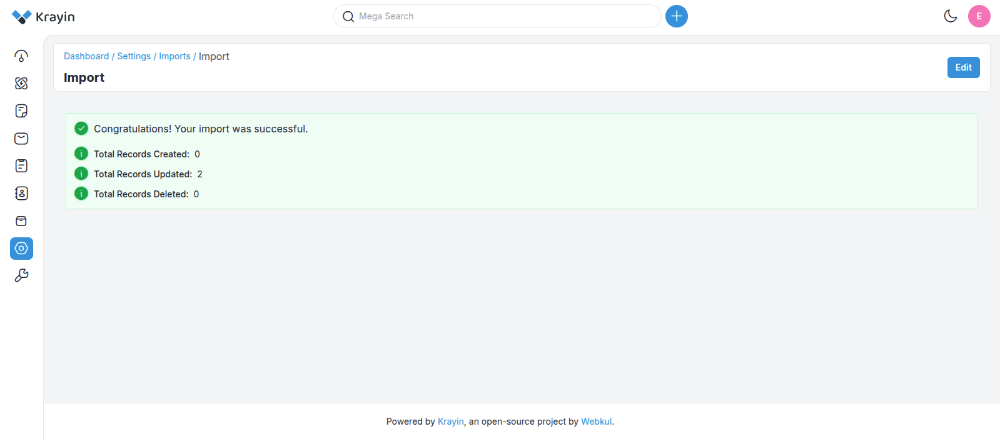

# Data Transfer

The **Data Transfer** package bulk-imports leads, persons, and products from CSV or XLSX files. It runs on Laravel's queue system so large datasets process in the background, with per-row validation, configurable error tolerance, and an editable preview before anything is written to the database.

This page covers the end-user workflow. For the package's place in Krayin's architecture, see the [DataTransfer entry on the Packages page](../architecture/packages.md#datatransfer).

## 🧩 What you can do

| Feature | Detail |
| --- | --- |
| **Queue or sync import** | Background processing for large files, sync for small ones. |
| **CSV + XLSX** | Both spreadsheet formats supported. |
| **Validation strategies** | `Stop on Error` halts on first failure; `Skip Errors` skips bad rows and continues. |
| **CSV delimiter** | Pick between `,`, `;`, and others. |
| **Allowed error count** | Threshold before the whole import fails. |
| **Create / Update / Delete** | Pick the operation per import. |
| **Editable preview** | Review and fix rows before committing. |

## 📁 Run an import

### 1. Open Data Transfer



In the admin:

1. Open **Settings**.
2. Search for **Data Transfer**.
3. Click it to land on the index page.

### 2. Configure the import



The Create page has two columns &mdash; the file on the left, the run-settings on the right.

#### Left column &mdash; file

- **Download a sample CSV** &mdash; pick the entity type and click *Download Sample*. This gives you a column-correct template.
- **Edit the sample** with your actual data.
- **Upload the modified file** via the file input.

#### Right column &mdash; settings

- **Action** &mdash; `Create`, `Update`, or `Delete`.
- **Validation Strategy** &mdash; `Stop on Error` *or* `Skip Errors`.
- **Allowed errors** &mdash; how many bad rows before the run fails.
- **CSV field separator** &mdash; `,` or `;` (or your custom delimiter).
- **Process in Queue** &mdash; toggle on for large files.

::: warning Queue connection
If you enable **Process in Queue**, set a working `QUEUE_CONNECTION` in your `.env` first:

```ini
QUEUE_CONNECTION=database
```

or

```ini
QUEUE_CONNECTION=redis
```
:::

Click **Save Import** to continue.

### 3. Review the preview



You land on the Imported page where you can:

- **Preview** every row.
- **Edit individual entries** before committing.

This is the last chance to fix data before it hits the database.

### 4. Validate



The validator runs against the rules for the chosen entity (leads / persons / products). Anything wrong is listed with the offending row and field &mdash; fix and re-validate.

### 5. Commit



When validation passes, the records are written. The new entries appear in the matching list view in the admin.

## ⚙️ Queue worker for large imports

Queued imports need a running worker. Two ways to keep it alive:

### Option A &mdash; Supervisor <small>*(recommended for production)*</small>

Install Supervisor:

```bash
sudo apt install supervisor
```

Drop a config at `/etc/supervisor/conf.d/laravel-worker.conf`:

```ini
[program:laravel-worker]
process_name=%(program_name)s_%(process_num)02d
command=php /path-to-your-project/artisan queue:work --sleep=3 --tries=3 --max-time=3600
autostart=true
autorestart=true
stopasgroup=true
killasgroup=true
user=your-username
numprocs=8
redirect_stderr=true
stdout_logfile=/path-to-your-project/worker.log
stopwaitsecs=3600
```

Tell Supervisor to pick it up and start it:

```bash
sudo supervisorctl reread
sudo supervisorctl update
sudo supervisorctl start 'laravel-worker:*'
```

### Option B &mdash; Manual <small>*(development only)*</small>

```bash
php artisan queue:work
```

You can also tune queue behaviour in `config/queue.php`.

## 🛡️ Error handling

- The **allowed errors** threshold caps how many bad rows the run will tolerate.
- Hitting the threshold **fails the run** before any data is committed.
- A detailed **error report** shows the failing rows and which validation rule each one tripped.

## 🔌 CRUD operations during import

| Action | What it does |
| --- | --- |
| **Create** | Inserts new rows. Skips rows whose unique key already exists. |
| **Update** | Modifies existing rows matched by identifier. |
| **Delete** | Removes existing rows. A validation error is raised if a referenced row doesn't exist. |

## 🧪 Verify

After a queued import:

```bash
php artisan queue:work --once
tail -f storage/logs/laravel.log
```

Check the imported rows appear in the relevant list view (Leads / Persons / Products). If a queued job appears stuck, confirm the worker is running with `supervisorctl status` (or `ps -ef | grep queue:work`).
