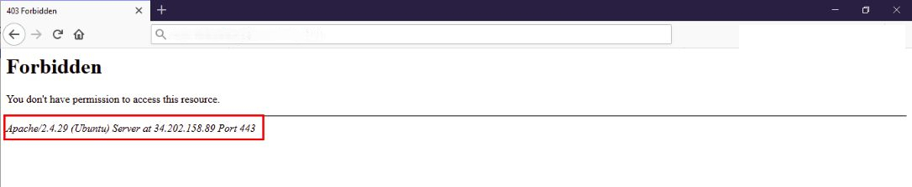

# Best Security Practices

A working Krayin install is only as secure as the server it runs on. This page collects the hardening steps every production deployment should apply &mdash; software hygiene, attack-surface reduction, HTTP headers, and ongoing monitoring.

## 🔒 Software updates

The single highest-leverage practice. Keep everything patched:

- Force **HTTPS** &mdash; encrypted by default, and a Google ranking factor.
- Keep **Krayin** itself up to date.
- Keep your **database**, **Adminer / phpMyAdmin**, **web server**, **Redis**, and any other service patched.
- Apply OS-level security updates on a schedule.
- Manage files only over **SSH / SFTP / HTTPS**. Disable FTP completely.
- On Apache deployments, use `.htaccess` to lock down system files.
- Disable unused ports and stop services you're not running.

## 🛡️ Limit admin exposure

- Whitelist specific IP addresses for the admin URL.
- Enforce **two-factor authentication** on admin accounts.
- Require strong, unique passwords (see [Strong passwords](#strong-passwords) below).
- Configure the firewall to allow only ports **80** (HTTP) and **443** (HTTPS) from the public internet.

### Restrict by IP via `.htaccess`

```apacheconf
RewriteEngine On
RewriteCond %{REQUEST_URI} .*/admin
RewriteCond %{REMOTE_ADDR} !=<your IP address>
RewriteCond %{REMOTE_ADDR} !=<another IP address>
RewriteRule ^(.*)$ - [R=403,L]
```

Remove all development leftovers from the server: log files, `.git` directories, database dumps, zip archives, etc.

## 🚫 Limit error message leakage

Verbose Apache errors expose the server version and OS. Edit your Apache config and add:

```apacheconf
ServerSignature Off
ServerTokens Prod
```

::: details Screenshot

:::

## 📁 Restrict unnecessary file access

Block direct access to files that shouldn't be served:

```apacheconf
<FilesMatch "\.(git|zip|tar|sql)$">
    Require all denied
</FilesMatch>
```

Pair this with a **Web Application Firewall (WAF)** to inspect traffic for suspicious patterns (e.g. credit-card data being exfiltrated).

## 🚫 Disable PHP execution inside `storage/`

User uploads land in `storage/`. Disabling PHP execution there prevents an attacker who slips a `.php` file through an upload from running code:

```apacheconf
<Directory "~/www/krayin/public/storage/">
    <FilesMatch "\.php$">
        Require all denied
    </FilesMatch>
    php_flag engine off
</Directory>
```

Restart Apache after editing.

## ⚙️ Server hardening

| Step | What it does |
| --- | --- |
| `mod_security` | Apache module that detects + blocks common intrusion patterns. |
| `mod_passive` | Brute-force protection. |
| User allow-list | Only specific OS users can SSH in. |
| Disable empty-password logins | Self-explanatory. |
| `iptables` review | Audit and lock down rules quarterly. |
| Off-site backups | Back up critical files to a separate location on a schedule. |

## 🔑 Strong passwords

Enforce strong, unique passwords for every account &mdash; admin, database, OS users, third-party integrations. Tools like the [Password Generator](https://passwords-generator.org/) make rotation painless.

Rotate the admin-panel IP whitelist when staff change.

## 🌐 HTTP security headers

Add these response headers via your web server config or Laravel middleware. Each one closes a specific class of browser-side attacks.

### Strict-Transport-Security (HSTS)

Forces the browser to use HTTPS even if a user types `http://`:

```text
Strict-Transport-Security: max-age=<expire-time>
```

### X-XSS-Protection

Asks the browser to enable its built-in XSS filter:

```text
X-XSS-Protection: 1; mode=block
```

### X-Frame-Options

Stops your admin from being embedded in an iframe &mdash; the standard defence against clickjacking:

```text
X-Frame-Options: deny
```

### X-Content-Type-Options

Disables MIME sniffing, which prevents attackers from tricking the browser into running uploaded files as scripts:

```text
X-Content-Type-Options: nosniff
```

### Content Security Policy (CSP)

A whitelist of where the browser may load resources from. Properly configured CSP is the strongest browser-side defence against XSS and content injection &mdash; see the [MDN CSP guide](https://developer.mozilla.org/en-US/docs/Web/HTTP/CSP) for the syntax.

## 📊 Continuous logging and monitoring

Hardening is a process, not a one-shot. Maintain ongoing visibility:

- Centralise web-server, application, and database logs.
- Alert on auth failures, 5xx spikes, and unusual outbound traffic.
- Watch for business-level anomalies &mdash; large volumes of leads coming from one IP, mass exports outside business hours, repeated password resets for the same account.

A patched server plus active monitoring catches the majority of real-world threats before they cause damage.
